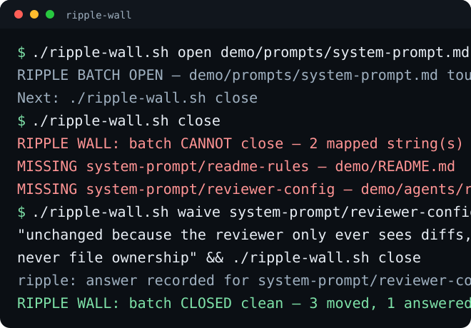

# ripple-wall

Change one foundational file in an agent setup — the system prompt, the
model roster, the rules file — and every copy of that fact scattered
through the repo goes stale in silence. This is a wall against that: one
JSON map of what depends on what, a batch that opens when a foundational
file is touched, and a close command that refuses until every attached
string has moved or carries a written reason.

Bash and stdlib Python 3.9+. No install, no dependencies, no daemon.




## Quick start

```bash
git clone https://github.com/eliferres/ripple-wall.git
cd ripple-wall
./ripple-wall.sh enumerate demo/prompts/system-prompt.md
```

That prints every file a change to the demo system prompt must drag with
it. Point `ripple-map.json` at your own files and it prints yours. The
[walkthrough](#the-walkthrough) below runs the full loop — open, refuse,
fix, waive, close — against the demo setup in this repo.

## The four ideas

**The map is the whole design.** `ripple-map.json` names *surfaces*
(files other files quietly depend on) and, under each, the *strings*
that must move with it. Writing the map is the work; the tool is the
part that never forgets it.

**The batch opens on the trigger, not on the commit.** The moment a
mapped file is touched, `open` snapshots every mapped file's hash. From
then on the wall knows, per string, whether it actually moved.

**Fail-closed, and specific about it.** `close` exits non-zero and names
each unaccounted string, its path, and why the map says it matters. No
summary counts, no "some files may need review."

**A waiver is a sentence, not a flag.** A string can be closed without
changing, but only behind `unchanged because ...` or
`blocked-on-owner: ...`, each of at least 40 characters — the blocked
form lets the batch close and keeps the item listed in `status` from
then on.

## The map format, verbatim

One surface from `ripple-map.json`, unedited. That is the whole schema:

```json
{
 "version": 1,
 "surfaces": {
  "system-prompt": {
   "_what": "The agent house rules. Every agent config and every doc that repeats a rule goes stale the moment this changes.",
   "triggers": ["demo/prompts/system-prompt.md"],
   "strings": [
    {
     "id": "readme-rules",
     "path": "demo/README.md",
     "why": "the README mirrors the house rules for humans; a stale mirror is what new contributors read first"
    }
   ]
  }
 }
}
```

`triggers` are exact paths, directories, or globs; a write to any of
them opens the batch. Every `path` is relative to the map file, so a
clone works from any directory (`~` and absolute paths also work, for
maps that guard files outside the repo). The `why` is not decoration —
it is what the refusal prints back at you months later, and a string
without a real one is a string nobody will honor.

## The walkthrough

Real commands against the demo setup in this repo. Copy-paste the whole
thing; it works from a fresh clone.

A new house rule arrives: agents must name the owner of every file they
change. Add it to the shared prompt and tell the wall.

```bash
printf -- '- Name the owner of every file you change.\n' >> demo/prompts/system-prompt.md
./ripple-wall.sh open demo/prompts/system-prompt.md
```

```
RIPPLE BATCH OPEN — demo/prompts/system-prompt.md touched (system-prompt).
  Every mapped string must move or carry a written reason before this batch closes.
  Next: ./ripple-wall.sh close
```

You update the two places you remember — the agent docs and the planner
— and call it done.

```bash
printf -- '- Name the owner of every file you change.\n' >> demo/docs/agents.md
printf -- '  - Name the owner of every file you change.\n' >> demo/agents/planner.yaml
./ripple-wall.sh close
```

```
RIPPLE WALL: batch CANNOT close — 2 mapped string(s) unaccounted for:
  MISSING system-prompt/readme-rules — demo/README.md (the README mirrors the house rules for humans; a stale mirror is what new contributors read first)
  MISSING system-prompt/reviewer-config — demo/agents/reviewer.yaml (the reviewer pins its own copy of the rules it checks against)
Update each one, or answer it: ./ripple-wall.sh waive <key> "unchanged because ..."
```

Two you would have shipped stale. Fix the README mirror; the reviewer
genuinely does not need the rule, so answer it in writing.

```bash
printf -- '- Name the owner of every file you change.\n' >> demo/README.md
./ripple-wall.sh waive system-prompt/reviewer-config "unchanged because the reviewer only ever sees diffs, never file ownership"
./ripple-wall.sh close
```

```
ripple: answer recorded for system-prompt/reviewer-config
RIPPLE WALL: batch CLOSED clean — 3 moved, 1 answered, across 1 surface(s).
```

The waiver, the refusal, and the close are all appended to
`.ripple/receipts.jsonl`, so the reason is still there the next time
someone asks why that file was skipped.

Reset the demo when you are done: `git checkout demo`.

## What is in the box

| Path | Role |
|---|---|
| `ripple-wall.sh` | The front door. `open` / `status` / `enumerate` / `waive` / `close`. |
| `ripple-map.json` | The map: surfaces, their triggers, and every string attached. |
| `tools/ripple_wall.py` | The wall itself, stdlib only. |
| `demo/` | A small fictional agent setup so the walkthrough runs on real files. |
| `hooks/` | Optional auto-open recipes: a Claude Code hook and a file watcher. |
| `tests/test_ripple_wall.py` | Real fixtures in temp dirs, including the walkthrough above. |
| `.ripple/` | Batch state, blocked items, and the receipts log. Gitignored. |

## What the wall enforces

Five refusals, each guarding a way config drift actually happens:

1. A mapped string that did not change and carries no answer blocks the
   close, by name.
2. A waiver that does not start `unchanged because ` is refused. Skipping
   a string has to read like a decision.
3. A waiver under 40 characters is refused. A reason nobody can read
   later is the same as no reason.
4. A waiver for a key that is not on the open surfaces is refused, with
   the valid keys printed — a typo must never look like an answer.
5. `blocked-on-owner:` lets the batch close but never clears the item.
   It stays in `status`, with its date, until you remove it by hand.

Anything the wall cannot verify, it refuses to guess about. Malformed
input dies loudly everywhere; `close` is the only command that can exit
non-zero on a clean, well-formed invocation.

## Why a hand-written map

The alternative is inference: parse the files, find the duplicated
strings, guess the dependencies. That fails in the direction that
matters — it misses the copy phrased differently, which is exactly the
copy that goes stale unnoticed, and it cannot know *why* two files hold
the same fact. A map is boring, auditable, diffable, and honest about
its own coverage. The map is also the artifact worth keeping: it is the
first written record of which files in your setup are load-bearing.

The wall is fail-closed for one reason. A warning you can scroll past
becomes a warning you always scroll past, and a drift checker that never
blocks anything is a checker that never protected anything.

## Limitations

- The map is hand-maintained, and it can go stale like anything else. A
  copy you never mapped is a copy the wall cannot see.
- Matching is per file, not semantic. It knows a file changed, not that
  it changed *correctly* — a whitespace edit satisfies a string. A file
  that vanishes mid-batch is refused as missing, not counted as moved.
- Single repo, single working tree. Strings living in another repo or in
  a hosted dashboard can only be tracked as a written answer.
- State is local to `.ripple/`. Two people running batches on the same
  checkout will step on each other.
- Exercised on macOS and Linux with bash and Python 3.9+. No Windows
  path handling.

## License

MIT
