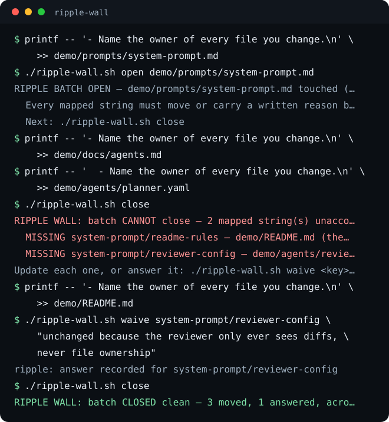

# ripple-wall

Change the system prompt, the model roster, or the rules file in an agent setup and every copy of that fact goes stale in silence. ripple-wall is one JSON map of what depends on what, plus a close command that refuses until every mapped copy has moved or carries a written reason. Bash and stdlib Python; run it from a clone or install the command.

No dependencies, no daemon.




## Quick start

Install the command (not on PyPI; this installs from GitHub):

```bash
pipx install git+https://github.com/eliferres/ripple-wall
```

Installed, `ripple-wall` reads `ripple-map.json` from the directory you
run it in, so run it from your project root: `ripple-wall enumerate
<path>` is the same as `./ripple-wall.sh enumerate <path>` in a clone.
One exception: an editable install (`pip install -e`) keeps the module
inside the clone, so it reads the clone's own map wherever you run it.
Point `RIPPLE_MAP` at the map you mean if that is not what you want.

Or clone it and run the demo in place:

```bash
git clone https://github.com/eliferres/ripple-wall.git
cd ripple-wall
./ripple-wall.sh enumerate demo/prompts/system-prompt.md
```

That prints every file a change to the demo system prompt must drag with
it. Point `ripple-map.json` at your own files and it prints yours. The
walkthrough below, [a batch from open to close](#a-batch-from-open-to-close),
runs the full loop (open, refuse, fix, waive, close) against the demo
setup in this repo.

Everything is in one place: `ripple-wall.sh` is the front door (`open`,
`status`, `enumerate`, `waive`, `attest`, `close`) over `tools/ripple_wall.py`,
which is the wall itself; `ripple-map.json` is the map; `demo/` is a
small fictional agent setup so the walkthrough runs on real files;
`hooks/` holds optional auto-open recipes for Claude Code and file
watchers; `tests/` runs real files in temp directories, including the
walkthrough below and the demo transcript; and `.ripple/`, gitignored,
holds the batch, the blocked items and the receipts log.

## A batch from open to close

Real commands against the demo setup in this repo. Copy-paste the whole
thing; it works from a fresh clone.

A new house rule arrives: agents must name the owner of every file they
change. Add it to the shared prompt and tell the wall.

```bash
printf -- '- Name the owner of every file you change.\n' >> demo/prompts/system-prompt.md
./ripple-wall.sh open demo/prompts/system-prompt.md
```

```
RIPPLE BATCH OPEN — demo/prompts/system-prompt.md touched (system-prompt).
  Every mapped string must move or carry a written reason before this batch closes.
  Next: ./ripple-wall.sh close
```

You update the two places you remember (the agent docs and the planner)
and call it done.

```bash
printf -- '- Name the owner of every file you change.\n' >> demo/docs/agents.md
printf -- '  - Name the owner of every file you change.\n' >> demo/agents/planner.yaml
./ripple-wall.sh close
```

```
RIPPLE WALL: batch CANNOT close — 2 mapped string(s) unaccounted for:
  MISSING system-prompt/readme-rules — demo/README.md (the README mirrors the house rules for humans; a stale mirror is what new contributors read first)
  MISSING system-prompt/reviewer-config — demo/agents/reviewer.yaml (the reviewer pins its own copy of the rules it checks against)
Update each one, or answer it: ./ripple-wall.sh waive <key> "unchanged because ..."
```

Two you would have shipped stale. Fix the README mirror; the reviewer
genuinely does not need the rule, so answer it in writing.

```bash
printf -- '- Name the owner of every file you change.\n' >> demo/README.md
./ripple-wall.sh waive system-prompt/reviewer-config "unchanged because the reviewer only ever sees diffs, never file ownership"
./ripple-wall.sh close
```

```
ripple: answer recorded for system-prompt/reviewer-config
RIPPLE WALL: batch CLOSED clean — 3 moved, 1 answered, across 1 surface(s).
```

The waiver, the refusal, and the close are all appended to
`.ripple/receipts.jsonl`, so the reason is still there the next time
someone asks why that file was skipped.

Reset the demo when you are done: `git checkout demo`.

## The design

**The map is the whole design.** `ripple-map.json` names *surfaces*
(files other files quietly depend on) and, under each, the *strings*
that must move with it. Writing the map is the work; the tool is the
part that never forgets it.

**The batch opens on the trigger, not on the commit.** The moment a
mapped file is touched, `open` snapshots every mapped file's hash. From
then on the wall knows, per string, whether it actually moved.

**Fail-closed, and specific about it.** `close` exits non-zero and names
each unaccounted string, its path, and why the map says it matters. No
summary counts, no "some files may need review."

**A waiver is a sentence, not a flag.** A string can be closed without
changing, but only behind `unchanged because ...` or
`blocked-on-owner: ...`, each of at least 40 characters: the blocked
form lets the batch close and keeps the item listed in `status` from
then on.

## Writing the map

One surface from `ripple-map.json`, unedited. That is the whole schema:

```json
{
 "version": 1,
 "surfaces": {
  "system-prompt": {
   "_what": "The agent house rules. Every agent config and every doc that repeats a rule goes stale the moment this changes.",
   "triggers": ["demo/prompts/system-prompt.md"],
   "strings": [
    {
     "id": "readme-rules",
     "path": "demo/README.md",
     "why": "the README mirrors the house rules for humans; a stale mirror is what new contributors read first"
    }
   ]
  }
 }
}
```

`triggers` are exact paths, directories, or globs; a write to any of
them opens the batch. Every `path` is relative to the map file, so a
clone works from any directory (`~` and absolute paths also work, for
maps that guard files outside the repo). The `why` is not decoration:
it is what the refusal prints back at you months later, and a string
without a real one is a string nobody will honor.

Some copies are not files: the rules pasted into a hosted chat
dashboard, a model name set in a vendor console. Give that string
`"kind": "attest"` and a `where` in place of `path`:

```json
{
 "id": "hosted-rules",
 "kind": "attest",
 "where": "the rules pasted into the hosted assistant's settings",
 "why": "the hosted assistant keeps its own copy of the house rules"
}
```

The wall has nothing to hash, so the string closes only on
`./ripple-wall.sh attest <key> "done: ..."`, a sentence of at least 40
characters saying what was done and where. `waive` answers it the same
way it answers a file.

A surface whose trigger is a directory asks every string of every file
in it, and most of those questions do not apply. On one real setup a
`hooks/` surface of 81 hooks asked each one about the settings file
that wires hooks and the rules file that names them. The settings file
wired 45 of them and the rules file named 18, so most of those
questions did not apply to the hook asked. A `when` condition narrows a
string to the triggers it is about:

```json
{
 "id": "settings",
 "path": "settings.json",
 "why": "the settings file wires the hooks it names",
 "when": { "mentions_trigger": true }
}
```

`mentions_trigger` asks the string only when its file contains the
triggering file's name; a file that is gone is asked anyway, so a
deleted copy still blocks. The flip side: a new or renamed file that no
copy names yet is not asked about at all, so the settings file is never
asked to wire a hook it has not heard of. Where that matters, cover it
with a `trigger_matches` condition or an unconditional string. `trigger_matches` takes a list of paths or
globs, written like `triggers`, and asks the string only when one of
them matched the change. Give both and both must hold. `enumerate`
prints only the strings a change is asked for.

A trigger directory also collects files nobody edits: an editor's
backups, a cache, build output. List them at the top of the map and
they never open a batch:

```json
"exclude_generated": ["hooks/*.bak", "hooks/cache/"]
```

Entries are written like `triggers`: exact paths, directories, or
globs, relative to the map.

## What close refuses

Seven refusals, each guarding a way config drift actually happens. Six
are about the answer you give:

1. A mapped string that did not change and carries no answer blocks the
   close, by name.
2. A waiver that does not start `unchanged because ` is refused. Skipping
   a string has to read like a decision.
3. A waiver under 40 characters is refused. A reason nobody can read
   later is the same as no reason.
4. A waiver for a key that is not on the open surfaces is refused, with
   the valid keys printed. A typo must never look like an answer.
5. `blocked-on-owner:` lets the batch close but never clears the item.
   It stays in `status`, with its date, until you remove it by hand.
6. An attest that does not start `done: `, runs under 40 characters, or
   names a file string is refused. A file string closes by changing,
   because the wall can check that; it cannot check a sentence.

The seventh is state the wall cannot trust: a map, batch file or blocked
list that is missing, will not parse, or is not the shape the wall
reads. It is never treated as an empty one, and it stops every command
that reads it.

A refusal names only what is missing. To read the whole batch at once,
`./ripple-wall.sh close --all` lists every string the batch asks for
with its state (moved, answered, blocked or MISSING) and closes
nothing. It reads the same verdict `close` acts on and exits the way
`close` would, so it also works as a dry run in a script.

| Exit | What it means | Printed on |
|---|---|---|
| 0 | The command did what was asked: a batch opened, a string was answered, a batch closed, or `close --all` found nothing missing. | stdout |
| 1 | `close` refused, naming every unaccounted string (or `close --all` found one), or there was no batch to close or answer into, or a waiver or attest was rejected. Answer it and run again. | stdout |
| 2 | The wall could not run at all: wrong usage, an unknown subcommand, or state it cannot trust. One line, and nothing is written. | stderr |

## Why a hand-written map

The alternative is inference: parse the files, find the duplicated
strings, guess the dependencies. That fails in the direction that
matters: it misses the copy phrased differently, which is exactly the
copy that goes stale unnoticed, and it cannot know *why* two files hold
the same fact. A map is boring, auditable, diffable, and honest about
its own coverage. The map is also the artifact worth keeping: it is the
first written record of which files in your setup are load-bearing.

The wall is fail-closed for one reason. A warning you can scroll past
becomes a warning you always scroll past, and a drift checker that never
blocks anything is a checker that never protected anything.

## Limitations

- The map is hand-maintained, and it can go stale like anything else. A
  copy you never mapped is a copy the wall cannot see.
- `mentions_trigger` sees only names already written down. A new or
  renamed file that no copy mentions yet passes without the question;
  pair it with `trigger_matches` or an unconditional string where a new
  file must be wired somewhere.
- Matching is per file, not semantic. It knows a file changed, not that
  it changed *correctly*: a whitespace edit satisfies a string. A file
  that vanishes mid-batch is refused as missing, not counted as moved.
- Single repo, single working tree. Strings living in another repo or in
  a hosted dashboard are attest strings: the wall records the sentence
  and cannot check it.
- State is local to `.ripple/`. Two people running batches on the same
  checkout will step on each other.
- Exercised on macOS and Linux with bash and Python 3.9+. No Windows
  path handling.

## License

MIT
